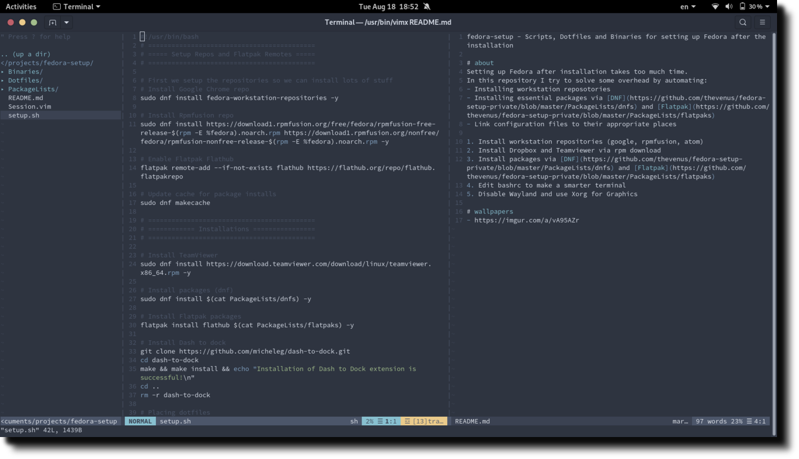

<p align="center">
  
</p>

<p align="center">
  <i>Scripts, Dotfiles and Binaries for setting up Fedora after installation</i>
</p>

# about
These are my dotfiles, packages, binaries, and scripts for setting up Fedora after a
fresh installation. 

### what is included?
- Installing workstation reposotories
- Installing essential packages via [DNF](https://github.com/thevenus/fedora-setup-private/blob/master/PackageLists/dnfs) and [Flatpak](https://github.com/thevenus/fedora-setup-private/blob/master/PackageLists/flatpaks)
- Link dotfiles files to their appropriate places
- Disable Wayland and use Xorg for Graphics

### directory structure
- Binaries  -  contains binaries(mainly bash scripts) that I use. These are installed to
    /usr/bin directory
- Dotfiles  -  contains dotfiles for vim, bash, tmux, and etc. Mainly installed to
    /home/user directory
- PackageLists  -  contains lists of DNF and Flatpak packages to install

# usage
$ means command does not require root access. # means command will require root access, so
run these commands with 'sudo'
```
$ git clone 
```
### general setup 
This will install packages, setup OS, and link dotfiles. 
```
# chmod +x setup.sh
# ./setup.sh
```

### only dotfiles
```
$ make sync-df
```
> Note: this command will delete pre-existing dotfiles (to get the full list, checkout Dotfiles directory)

### only binaries
```
# make sync-bin
```
> Note: this command will delete pre-existing binaries (to get the full list, check out Binaries directory)


# wallpapers
- https://imgur.com/a/vA95AZr
